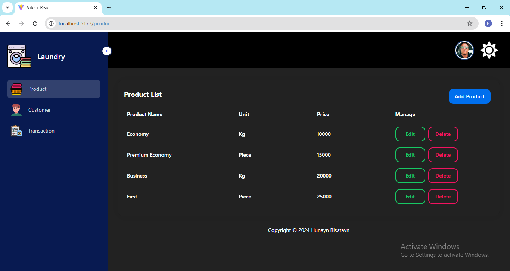
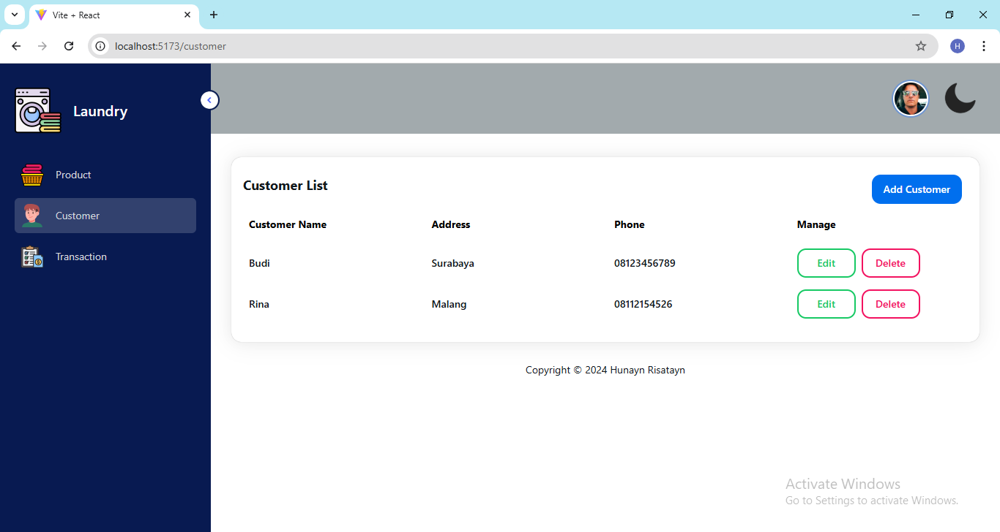
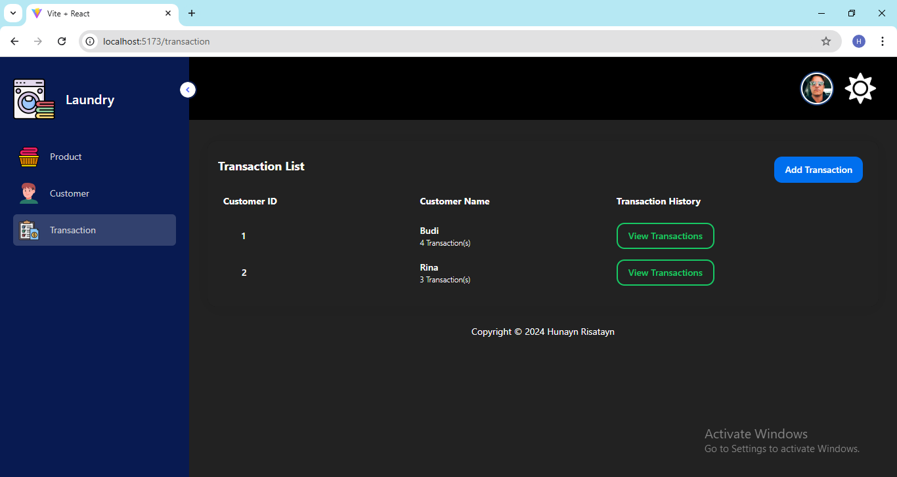
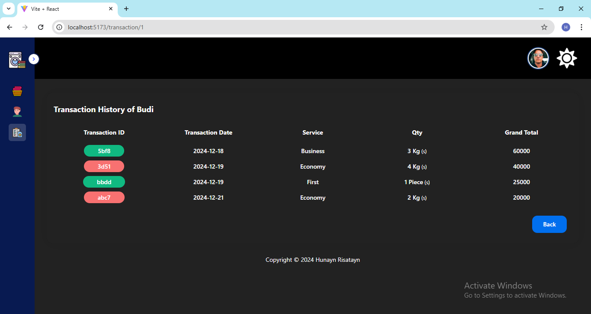
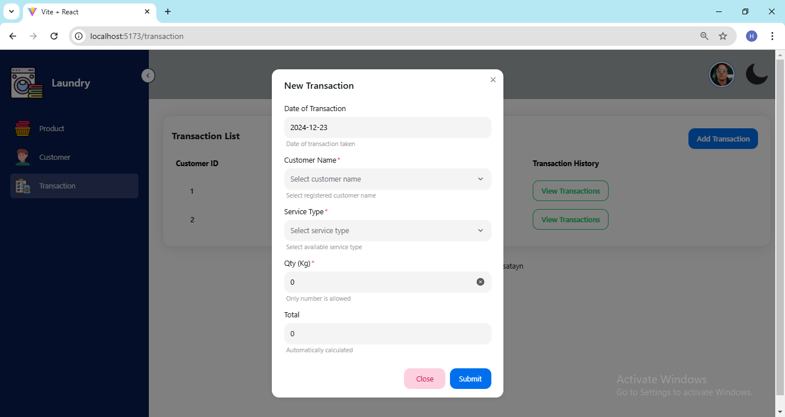

<!-- # React + Vite

This template provides a minimal setup to get React working in Vite with HMR and some ESLint rules.

Currently, two official plugins are available:

- [@vitejs/plugin-react](https://github.com/vitejs/vite-plugin-react/blob/main/packages/plugin-react/README.md) uses [Babel](https://babeljs.io/) for Fast Refresh
- [@vitejs/plugin-react-swc](https://github.com/vitejs/vite-plugin-react-swc) uses [SWC](https://swc.rs/) for Fast Refresh -->

<!-- LOGO -->

  

  <h3 align="center">Enigma Laundry</h3>

<!-- TABLE OF CONTENTS -->

  
Table of Contents

  <ol>
    <li>
      <a href="#description">Description</a>
    </li>
    <li><a href="#design">Design</a></li>
  </ol>

<!-- DESCRIPTION -->

## Description

A simple laundry web written in JavaScript library’s React. It has three main menus, two of them to administer the master data and the rest for transactional data. An overlying component is used for data management. This app is reading from and writing to JSON file using server-like JSON Server

(<a href="#readme-top">back to top</a>)

<!-- DESIGN -->

## Design

These images below are several designs of the laundry web

 <b>Product List dark-themed Page</b>

 <b>Customer List light-themed Page</b>

 <b>Transaction List of All Customer dark-themed Page</b>

 <b>Transaction History per Customer dark-themed Page</b>

 <b>New Transaction</b>

(<a href="#readme-top">back to top</a>)

